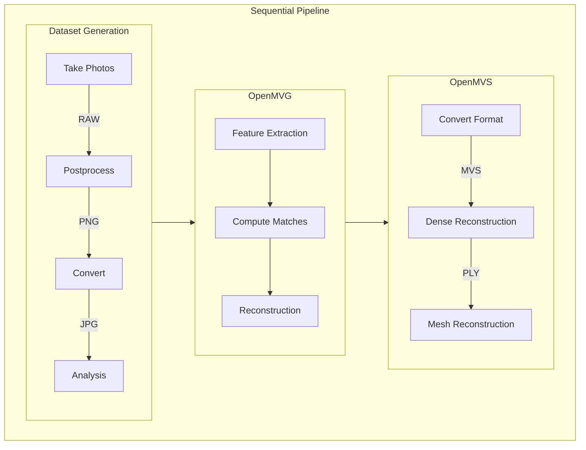

# Structure from Motion (SfM)

This repository contains the source code to build an OCI container using Docker
used to run a structure from motion pipeline.
The container is designed to be used on a folder containing the dataset composed
of images from the object to reconstruct.

## Pipeline

For this repository the container makes use of the
[OpenMVG](https://github.com/openMVG/openMVG) and
[OpenMVS](https://github.com/cdcseacave/openMVS) projects. Both tools integrate
rather easily and be run on the CPU and even be placed into a container.
Optionally CUDA is can be used but this is *not* supported by this container.

The following diagram visualizes all the steps required to generate a 3D model
of the Brunsviga 13 RK:



The only input to the pipeline is a dataset of photos of the machine. These
where shot using a camera manufactured by Samsung with a NX2000 lens.
For getting the maximum quality out, the camera saves the images as SRW raw
files. In order to improve visual quality and reduce file size the raw images
are postprocessed with [RawTherapee](https://github.com/Beep6581/RawTherapee).
Improvements were made by sharpening, removing noise, removing dark shadows and
enhancing edges. The product are loss lessy compressed PNG files.
Unfortunately OpenMVG is unable to read EXIF data from PNG files which is
required in order to determine camera features such as focal length.
For this reason the PNG files are further converted into JPGs.
These are the actual files served as input for OpenMVG.

For further explanation of how OpenMVG works see their
[wiki](https://github.com/openMVG/openMVG/wiki/OpenMVG-on-your-image-dataset).

## Quick start

You can use the makefile in order to build the docker image:
```
make build
```

Then the pipeline can be run on a dataset stored in the `jpg` folder in your
working directory:
```
make run
```

The finished 3D model will be stored in
`output/reconstruction_sequential/scene.ply`.
